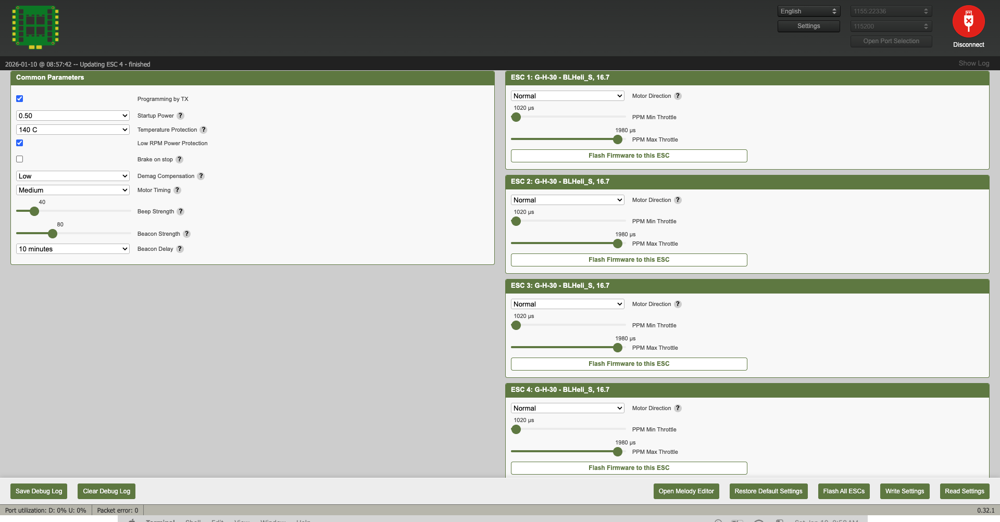

# Configure ESC
1. After completing soldering connect the fc using a USB cable to your computer.
2. Open a browser and go to https://esc-configurator.com/.
3. Click on Select Serial Port and select "Crazyflie 2.x ...", Then click on Connect button in the top right corner.
4. After connecting, click of Read Settings button and then click on the blue button "Flash All ESCs" in the bottom of the page.
5. Select BLHeli_S and latest stable version and flash all ESCs.
6. After flashing is done, andjust the PPM min and max trhottle values using the sliders for each ESC to 1020 and 1980 as shown in the image below. Then, click on Write Settings button to save the settings.
7. Finaaly click on Disconnect button in the top right corner. 




# Configure Crazyflie

## Configure ID
Install cflcient if not already installed.

```bash
pip3 install cflcient
```

Connect the CF Bolt using a USB cable to your computer and open cfclient by typing `cfclient` in your terminal.

Click on the Scan button on the top left and select "USB" from the dropdown menu. Then click on the Connect button in the top right corner.

Then go to the Connect Tab and select Configure 2.x.

Set the desired radio channel and id. We use channel 100.

Finally click on the Write button and disconnect the Crazyflie from the computer.

## Flash Firmware

Install the dependencies:
```bash
brew install gcc-arm-embedded coreutils gnu-sed
```

Clone the modified firmware from the following repository:

```bash
git clone --recursive https://github.com/flslab/crazyflie-firmware.git
cd crazyflie-firmware
```

Configure the firmware for CF Bolt:

```bash
make bolt_defconfig
```

Build the firmware:

```bash
make -j$(sysctl -n hw.ncpu)
```

Connect a battery to the FC and follwow these steps to manually entering bootloader mode:

- Turn the Crazyflie off
- Start the Crazyflie in bootloader mode by pressing the power button for 3 seconds. - Both the blue LEDs will blink.

Then, run the following command to flash the firmware to the FC:

```bash
make cload
```

For further information and instructions for Ubuntu and Windows, please refer to the original Bitcraze documentation here: https://github.com/bitcraze/crazyflie-firmware/blob/master/docs/building-and-flashing/build.md