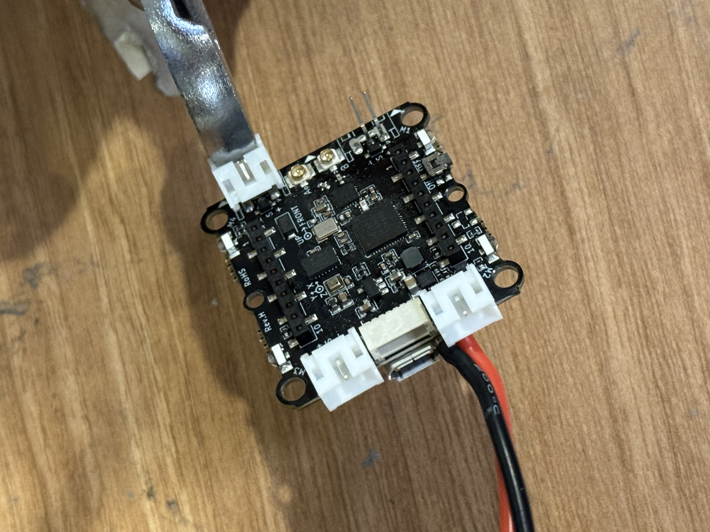
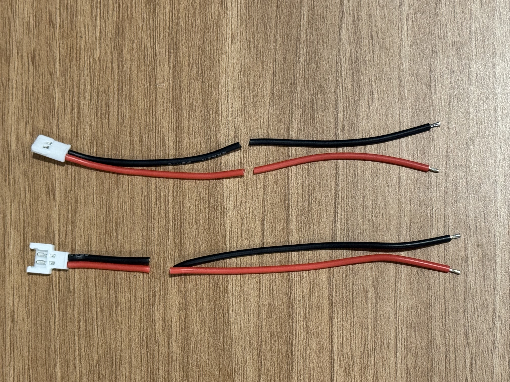
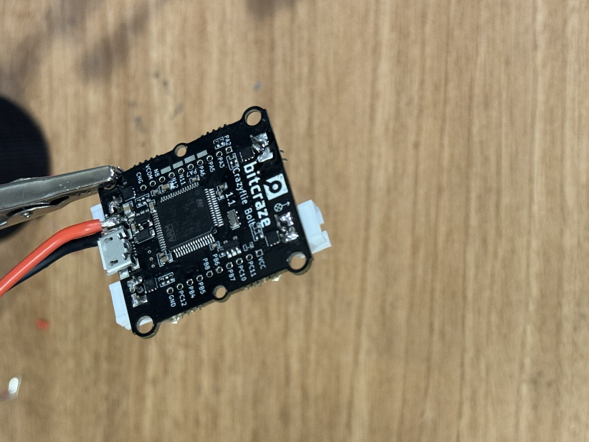

Required tools: 
1. Soldering iron
2. Screwdriver set
3. Wire cutters and strippers
4. Pliers
5. Desoldering wick

Required parts:
1. Motors x 4
2. ESC x 1
3. CF Bolt Flight controller x 1
4. Power wires x 1
5. Capacitor x 1
6. Mulex wire with male connector x 1
7. Mulex wire with female connector x 1
8. Servos x 2
9. LED strips
10. Magnet wires
11. Power regulator x 1
12. Raspberry Pi Baseboard x 1

Prepration:

Unbox the motors and screw them to the frame. Use the 5mm screws (the meduim size in the package).
When mounting the motors, make sure the wires from the motor are facing towards the center of the frame.
Cut the wires from motor to desired length.

Remove the 3-pin connectors from the flight controller. First remove the plastic housing gently using a plier, and then remove the pins using a soldering iron.

Cut the mulex wires as shown below.

Solder the capacitor and power wires to the bottom side of the ESC.
Solder the mulex wire with the male connector and power wires to the top side of the ESC.
Solder the other ends of the power wires to CF bolt flight controller.

Mount the ESC on the frame using the 8mm screw. The ESC should be mounted on the opposite side of the frames from the motors.

Mount the flight controller on the frame using the 8mm screw and rubber balls.

