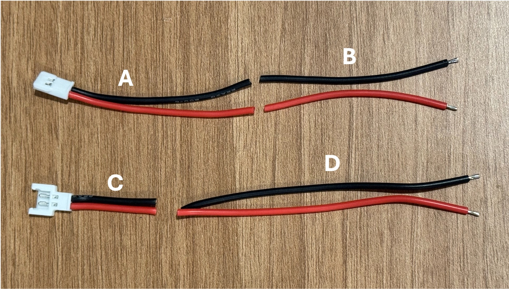
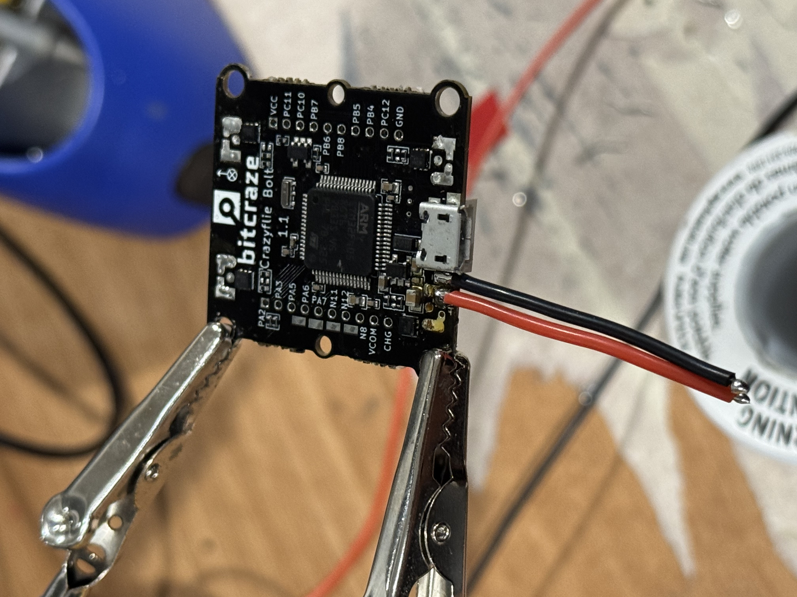
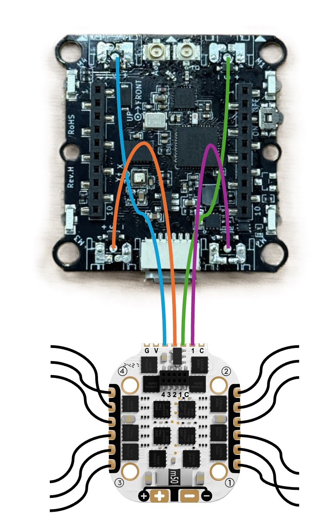
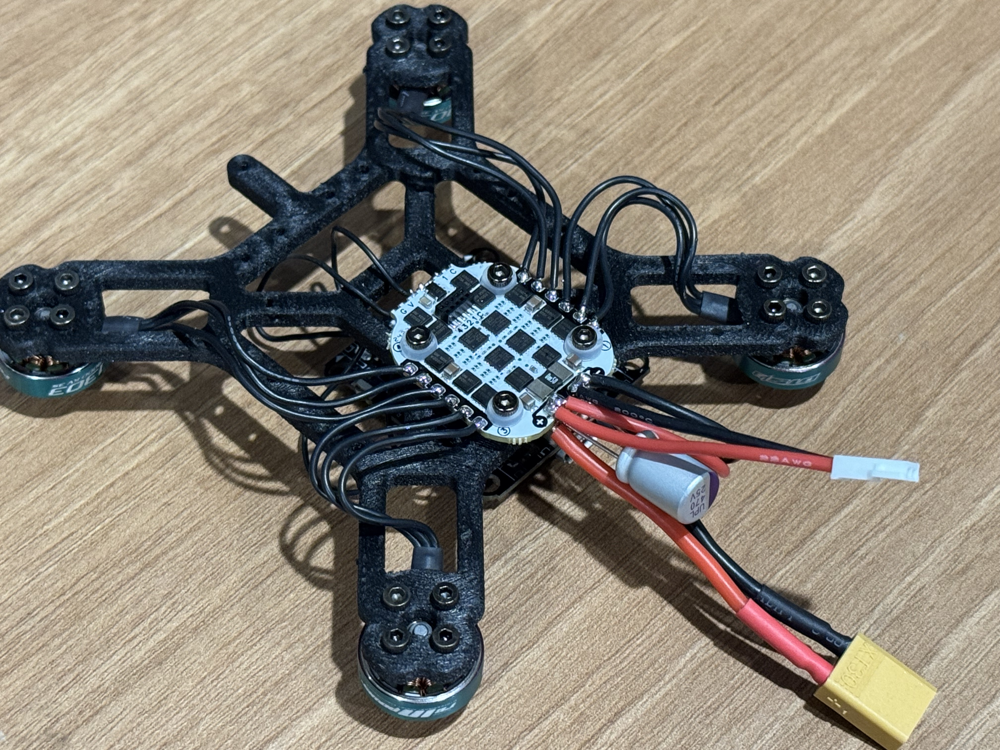

# Soldering and Assembling

Required tools:

1. Soldering iron
2. Screwdriver set
3. Wire cutters and strippers
4. Pliers
5. Desoldering wick

Required parts:

1. Motors x 4
2. ESC x 1
3. CF Bolt Flight controller x 1
4. Power wires x 1
5. Capacitor x 1
6. Mulex wire with male connector x 1
7. Mulex wire with female connector x 1
8. Servos x 2
9. LED strips
10. Magnet wires
11. Power regulator x 1
12. Raspberry Pi Baseboard x 1

## Prepration:

Step 1: Unbox the motors and screw them to the frame. Use the 5mm screws (the meduim size in the package).
When mounting the motors, make sure the wires from the motor are facing towards the center of the frame.
Cut the wires from motor to desired length.

Step 2: Cut the mulex wires as shown below.

Step 3: Cut the XT30 power wires from the ESC to desired length(around 2 inch or 5 cm).

Step 4: Cut 4 peice of wires for motor signal wires (around 1.5-2 inch or 4-5 cm).

Step 5: Cut 3 pieces of wires making a USB cable (around 2.5 inch or 6 cm)

Step 6: Cut the connectors of the servos.

Step 7: Cut 5 pieces of magnet wires around 20 cm each.

Step 8: Strip the tip of all prepared wires in Steps 1 to 7 and put solder on them. For magnet wires use a soldering iron and solder to melt the coating.

Step 9: Cut two strips of 24 and 26 LEDs from LED strip. When cutting make sure you cut from the lines between the LEDs such that each LED has 3 connection points. One ground (GND), one data (DI), and one power (VCC/5V).

Step 10: Remove the 3-pin connectors from the flight controller. First remove the plastic housing gently using a plier, and then remove the pins using a soldering iron.

Step 11: Desolder the power wires from the FC.

## ESC and FC Assembly

Step 12: Solder wire B to the FC.

Step 13: Solder the capacitor and XT30 power wires to the bottom side of the ESC.

Step 14: Solder the mulex wire with the male connector (wire A) and the other ends of wire B to the top side of the ESC.

Step 15: Mount the ESC on the frame using the 8mm screws. The ESC should be mounted on the opposite side of the frame from the motors.

Step 16: Solder the motor signal wires from step 4 to the FC. Make sure you connect the wires to the top side of the FC.

Step 17: Pass the motor signal wires through the frame and solder them to the corresponding motor posts on the ESC. Refer to the image below.

Step 18: Connect the FC anttena to the coaxical connector labeled as A on the top of the flight controller. Mount the flight controller on the frame using the 8mm screws and rubber balls.

Step 19: Solder motor wires from the motors to the ESC. Refer to the image above to see the correct wire ordering for each motor.

Finally your frame should look like this:

## RPi Baseboard and Power Assembly

Step 20: Solder the red wire of C to the VIN pin of the power Regualtor and red wire D to the OUT pin of the power Regualtor. Solder the black wires to the GND pins of the power Regualtor.

Step 21: Solder the power wires of the servo the the OUT and GND of the power regulator. Connect red to OUT and brown/black to GND.

Step 22: Solder the other ends of wire D to the RPi baseboard 5V and GND pins.

Step 23: Solder the yellow signal wires of the servos to the pins 12 and 35 on the RPi baseboard.

Step 24: Solder a 3-wire male connector to the RPi baseboard with wires for 5V, GND, and data. Connect the data wire to the pin 19 on the RPi baseboard.

Step 25: Solder 3 magnet wires to the input 5V, GND and Data pints of the 26-LED strip.

Step 26: Solder 2 magent wires to the 5V and GND pins of the 24-LED strip on its opposite side from the input pins.

Step 27: Connect the data pin of the 26-LED strip to the data pin of the 24-LED strip.

Step 28: Solder the 3-wire female connector to the other ends of the magnet wires. There should be 2 ground wires, 2 5V wires and one data wire. Use heat shring tubings to cover the connections.

